# Excel 1주차 정규 과제 

📌Excel 정규과제는 매주 정해진 분량의 『*진짜 쓰는 실무 엑셀*』 을 읽고 학습하는 것입니다. 이번주는 아래의 **EXCEL_1st_TIL**에 나열된 분량을 읽고 공부하시면 됩니다.

아래의 문제를 풀어보며 학습 내용을 점검하세요. 문제를 해결하는 과정에서 개념을 스스로 정리하고, 필요한 경우 제시된 강의를 참고하여 보완하는 것이 좋습니다.

**교재 실습 예제 파일은 1주차 과제 설명 노션에 있습니다. 해당 파일을 다운 후 실습 진행해주시면 됩니다.**

**👀(수행 인증샷은 필수입니다.)** 

## EXCEL_1st_TIL

### 1장 시작부터 남다른 실무자의 엑셀 활용
#### 01. 엑셀 기본 설정 변경으로 맞춤 환경 만들기 (범위 제외)
#### 02. 엑셀 좀 사용하려면 반드시 알아야 할 엑셀 기본키 (범위 제외)
#### 03. 엑셀의 기본 동작 원리 이해하기
#### 04. 엑셀에서 발생하는 모든 오류와 해결 방법 총정리
#### 05. 실무자면 꼭 알아야 할, 필수 단축키 모음

### 2장 실무자라면 반드시 알아야 할 엑셀 활용
#### 01. 보기 좋은 표, 활용할 수 있는 데이터를 위한 필수 상식
#### 02. 편리한 엑셀 문서 작업을 위한 실력 다지기
#### 03. 엑셀로 시작하는 기초 데이터 분석
#### 02. 엑셀 데이터 가공을 위한 텍스트 나누고 합치기

## Study Schedule

| 주차  | 공부 범위     | 완료 여부 |
| ----- | ------------- | --------- |
| 1주차 | p.22~111    | ✅         |
| 2주차 | p.112~157   | 🍽️         |
| 3주차 | p.158~213  | 🍽️         |
| 4주차 | p.214~273 | 🍽️         |
| 5주차 | p.274~339 | 🍽️         |
| 6주차 | p.340~425 | 🍽️         |
| 7주차 | p.426~472 | 🍽️         |

 

<!-- 여기까진 그대로 둬 주세요-->

---

# 1️⃣ 학습 내용 정리

## 01-3. 엑셀의 기본 동작 원리 이해하기
> **셀 참조 방식에 대해 정리해주세요.**

- 엑셀에서 수식을 복사할 때 셀 주소가 어떻게 변하는지 결정하는 기능이다.
- 상대참조는 수식을 복사하는 위치에 따라 셀 주소도 자동으로 이동하는 기본 방식이다.
- 절대참조는 F4 키를 눌러 주소에 $를 붙이며, 어디로 복사하든 지정된 셀만 고정해서 가리킨다.
- 혼합참조는 행이나 열 중 한쪽만 고정해서 특정 방향으로만 주소가 바뀌게 만드는 방식이다.
- 계산하려는 표의 구조와 목적에 따라 이 세 가지 방식을 적절히 섞어서 써야 오류가 나지 않는다.

## 01-4. 엑셀에서 발생하는 모든 오류와 해결 방법 총정리
> **숫자처럼 보이는 문자를 빠르게 확인하고 해결하기(51 ~52p)를 진행 후 인증사진을 첨부해주세요.**
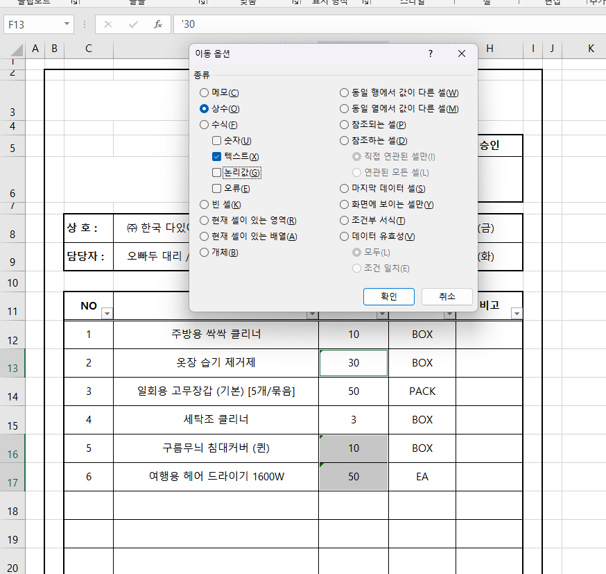
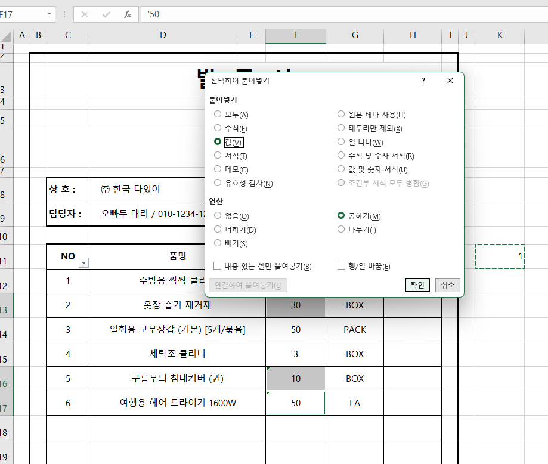

## 01-5. 실무자면 꼭 알아야 할, 필수 단축키 모음
> **이번에 배운 단축키에 대해 정리해주세요.**

- 엑셀 단축키는 동시에 함께 누르는 Ctrl 조합과 차례대로 순서에 맞춰 누르는 Alt 조합으로 나뉜다.

- 작업 중 데이터 손실을 막기 위해 Ctrl + S로 수시로 저장하고, Shift + F11로 새로운 시트를 빠르게 추가할 수 있다.

- Ctrl + PageUp/PageDown으로 시트를 부드럽게 이동하며, Ctrl + 마우스 휠을 통해 작업 화면 배율을 쉽게 조절할 수 있다.

- 마우스 우클릭을 대신하는 Shift + F10 팝업 메뉴 호출과 Alt → P → R → S를 활용한 인쇄 영역 설정 기능이 실무에 유용하다.

- 원활한 데이터 처리를 위해 Alt → W → F → F로 기준 틀을 고정하고, Ctrl + Shift + L을 눌러 자동 필터를 빠르게 적용할 수 있다.

## 02-1. 보기 좋은 표, 활용할 수 있는 데이터를 위한 필수 상식
> **데이터와 표를 비교해주세요**

- 표(서식)는 사람이 한눈에 파악하기 좋게 시각화된 형태이지만, 정렬이나 특정 값 검색 시 별도의 복잡한 함수가 필요해 번거롭다.

- 데이터는 엑셀의 관리 및 분석에 최적화된 구조로, 기본 정렬 기능을 통해 원하는 순위나 결과값을 손쉽게 찾을 수 있다.

- 새로운 정보나 구분자가 추가될 때 표는 전체 레이아웃을 수정하고 빈칸이 발생하는 문제가 생기지만, 데이터 형식은 유연하고 지속적인 누적 관리에 유리하다.

> **셀 병합 기능을 자제해야 하는 이유를 정리해주세요.**

- 셀 병합 기능을 사용하면 병합된 여러 셀 중에서 오직 첫 번째 셀의 값만 인식되는 것이 문제의 핵심이다.

- 이로 인해 범위 선택, 자동 채우기, 데이터 정렬, 피벗 테이블 등 엑셀의 필수 기능 사용이 제한되는 것이 치명적인 단점이다.

- 겉보기에는 깔끔할 수 있으나, 함수 적용 시 엉뚱한 결과값을 반환할 위험이 커서 실무에서는 반드시 자제해야 할 기능이다.

## 02-2. 편리한 엑셀 문서 작업을 위한 실력 다지기
> **셀 병합하지 않고 가운데 정렬하(75 ~77p)를 진행 후 인증사진을 첨부해주세요.**
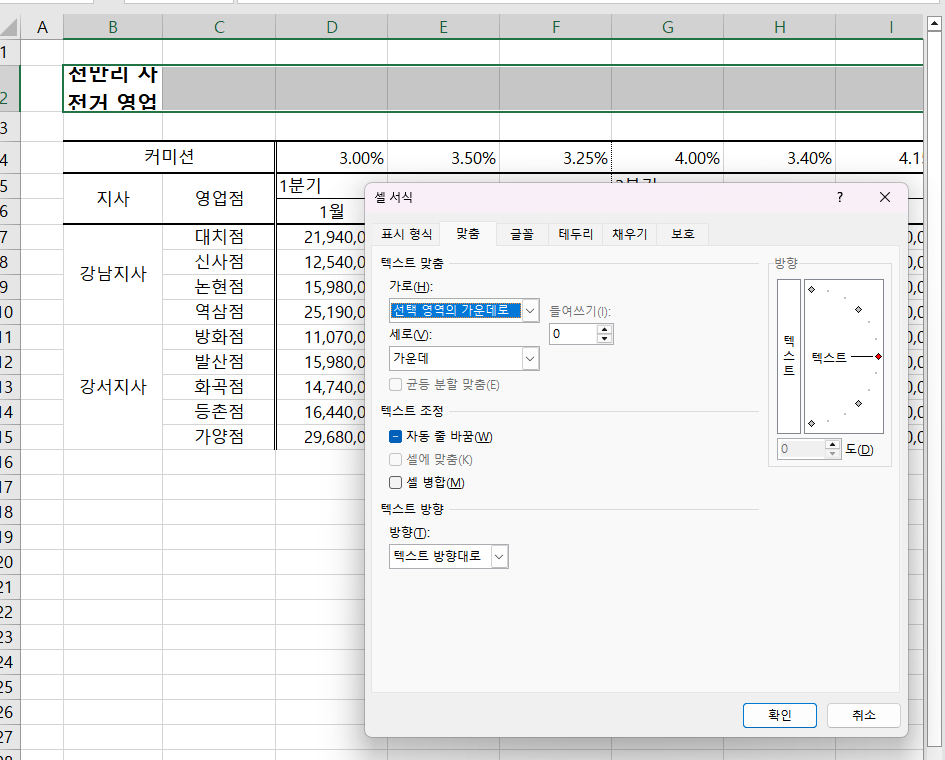
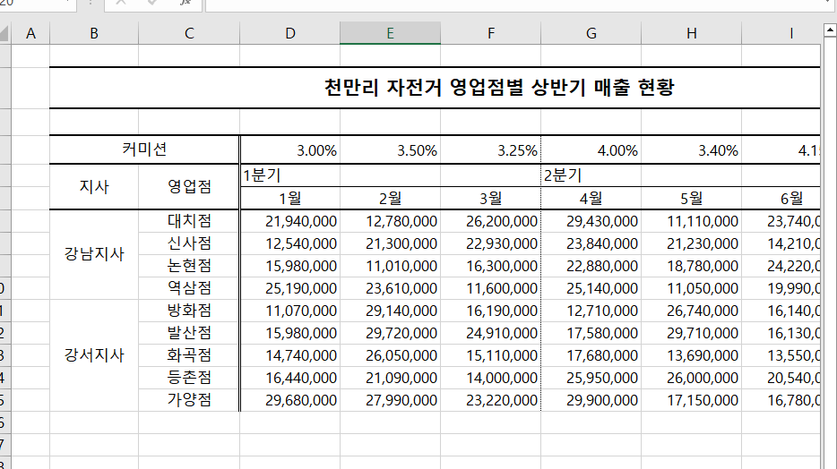

> **셀 병합 해제 후 빈칸 쉽게 체우기(78 ~79p)를 진행 후 인증사진을 첨부해주세요.**
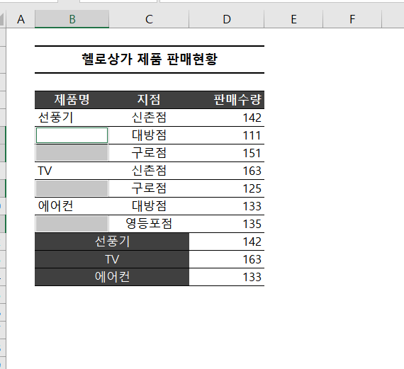
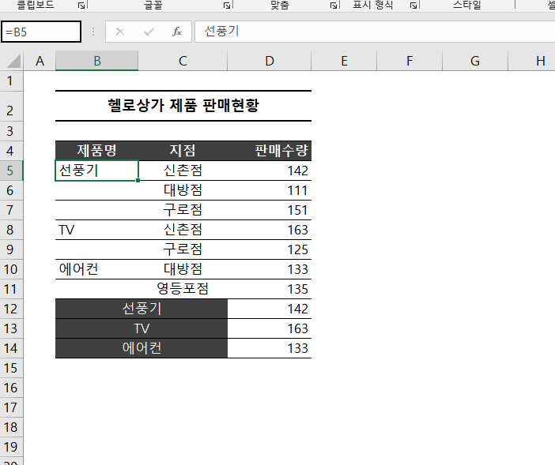

> **빈 셀을 한 번에 찾고 내용 입력하기(80 ~81p)를 진행 후 인증사진을 첨부해주세요.**
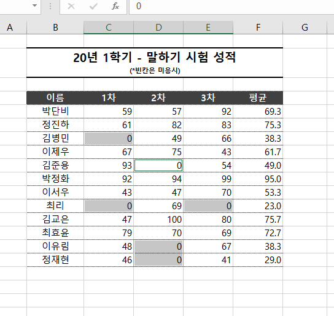

> **숫자 데이터의 기본 단위를 한 번에 바꾸는 방법(84 ~87p)를 진행 후 인증사진을 첨부해주세요.**
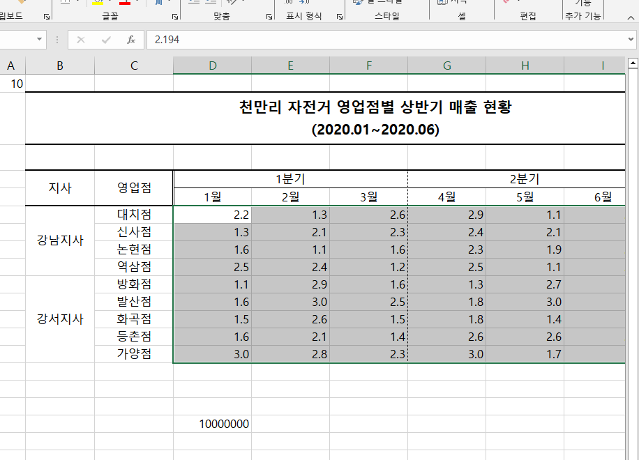

## 02-3. 엑셀로 시작하는 기초 데이터 분석
> **행/열 전환하여 새로운 관점으로 데이터 살펴보기(88 ~90p)를 진행 후 인증사진을 첨부해주세요.**
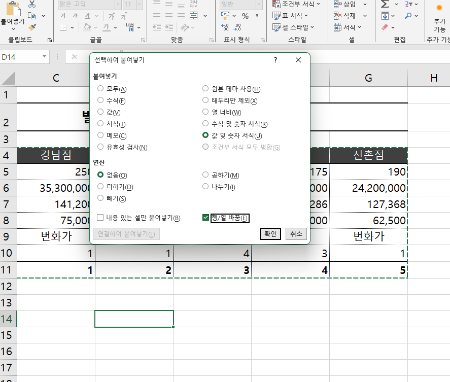
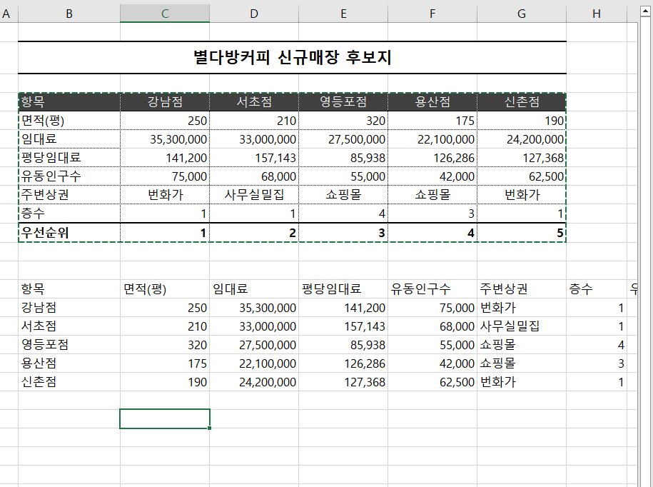

> **중복된 데이터 입력 제한하기(90 ~92p)를 진행 후 인증사진을 첨부해주세요.**
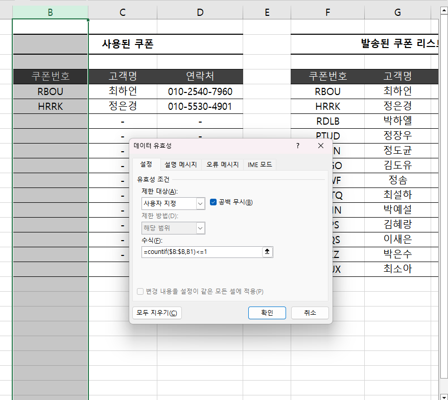
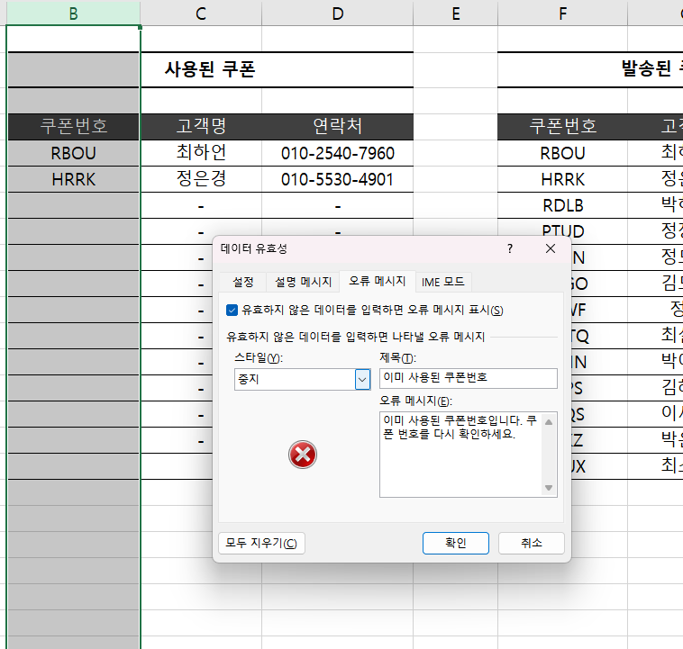

## 02-4. 엑셀 데이터 가공을 위한 텍스트 나누고 합치기
> **여러 줄을 한 줄로 합치거나 한 줄을 여러 줄로 분리하기(104 ~107p)를 진행 후 인증사진을 첨부해주세요.**
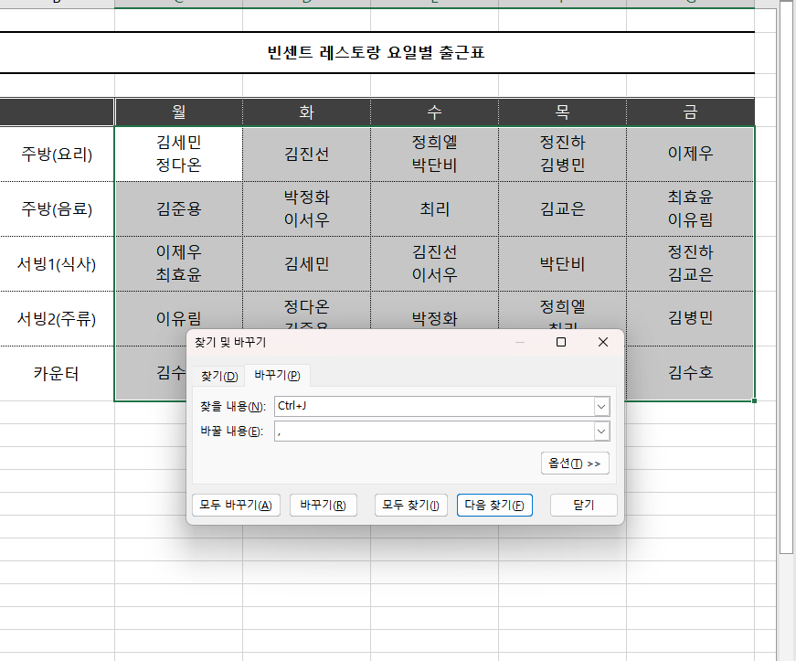

> **여러 열에 입력된 내용을 간단하게 한 열로 합치기(108 ~109p)를 진행 후 인증사진을 첨부해주세요.**
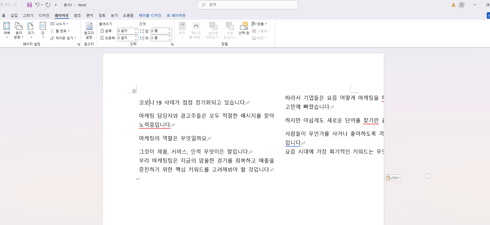

---

### 🎉 수고하셨습니다.

